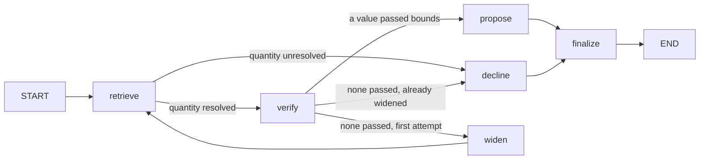

# aero-spec-rag

Ask a natural-language question about an aerospace or guidance parameter — a drag
coefficient, ISA density at altitude, a proportional-navigation gain — and get
back a **structured, cited, machine-usable** answer instead of prose. A LangChain
ingestion pipeline chunks and embeds (bge-small-en-v1.5) a small markdown corpus
into a local Chroma store; a LangGraph state machine then retrieves the relevant
passages, checks any number it extracts against a hardcoded table of physical
plausibility bounds, discards values that fail (widening retrieval once before
giving up), and emits a JSON object carrying the value, its unit,
the source document, a confidence score, a `verified` flag, and the passages it
relied on. It is built as a companion to a missile-guidance simulator: the
intended consumer is a simulation config loader, not a human reading paragraphs.

> ⚠️ **Illustrative data, not real specs.** Every number in `src/corpus/` was
> written for this repository. The atmosphere and aerodynamics documents are
> standard textbook physics restated in original wording; the interceptor and
> target parameter sets are **invented order-of-magnitude placeholders**, clearly
> labelled `source_type: illustrative`. Nothing here describes, or is derived
> from, any real weapon system. Do not use it for anything but simulation
> plumbing and portfolio demonstration.

## Setup

```bash
python3 -m venv .venv
source .venv/bin/activate
pip install -r requirements.txt
```

No API key is required. The default embedding backend is
[BAAI/bge-small-en-v1.5](https://huggingface.co/BAAI/bge-small-en-v1.5) run on
CPU via fastembed (ONNX); the ~70 MB model downloads once on first ingest. For a
fully air-gapped run, `AERO_EMBEDDINGS=local` switches to a zero-download
hashing embedder (see [DECISIONS.md](DECISIONS.md)).

### Optional: run a real model locally with Ollama

Both model slots can be served by [Ollama](https://ollama.com), so the project
gains a genuine LLM and learned embeddings without any API key or cloud call:

```bash
ollama pull llama3.1:8b        # chat model
ollama pull nomic-embed-text   # embedding model

export AERO_LLM=ollama                 # enables classification + narration
export AERO_EMBEDDINGS=ollama          # serve embeddings from Ollama instead of fastembed
python -m src.ingest --rebuild         # required: the store is dimension-specific
uvicorn src.api:app --reload --port 8000
```

> **If `ollama pull` times out**, your network may not have a route to
> Cloudflare R2, where Ollama hosts model blobs (`dial tcp 172.64.x.x:443: i/o
> timeout`). Pulling the equivalent GGUF from HuggingFace goes over a different
> CDN and works:
>
> ```bash
> ollama pull hf.co/CompendiumLabs/bge-small-en-v1.5-gguf
> export AERO_OLLAMA_EMBED_MODEL=hf.co/CompendiumLabs/bge-small-en-v1.5-gguf
> ```
>
> bge-small-en-v1.5 is 24 MB and 384-dimensional; this is the combination the
> project was verified against.

Enabling the LLM adds exactly two capabilities, and **neither can produce a
number**:

1. **Quantity classification fallback.** The alias registry in `src/bounds.py`
   is exact-match. When it misses a phrasing — *"how heavy is the bird at
   launch?"* — the LLM maps the query onto a registry key, and is constrained to
   return a key that already exists. The identified quantity then steers
   retrieval, and the value still comes from a parsed, bounds-checked table row.
2. **Answer narration.** The `answer` sentence is rephrased in natural language
   from fields that are *already* selected and verified. The sentence is
   rejected unless the verified value survives into it verbatim, and the
   citation is appended deterministically rather than asked of the model. On
   rejection or backend failure the deterministic sentence is kept and a
   `narration_unavailable` flag is raised.

`narration_model` in the response records which model phrased the answer, and is
`null` whenever the deterministic sentence was used. Every structured field
(`value`, `unit`, `source_doc`, `verified`, `confidence`) is produced the same
way regardless of backend.

With the LLM off — the default — no model is contacted at all.

## Ingest the corpus

```bash
python -m src.ingest
```

Chunk ids are content-addressed, so this is idempotent — re-running upserts the
same ids and prunes chunks whose source text has been deleted. Use
`python -m src.ingest --rebuild` to start from an empty store.

## Run the API

```bash
uvicorn src.api:app --reload --port 8000
```

Interactive docs are then at `http://127.0.0.1:8000/docs`.

### Or with Docker

```bash
docker build -t aero-spec-rag .
docker run --rm -p 8001:8001 aero-spec-rag
```

The embedding model and the ingested corpus are baked in at build time, so the
container starts serving immediately on `:8001` with no API key and no network
(`HF_HUB_OFFLINE=1`). This image is also what
[missile_guidance_sim](https://github.com/Vinvin00/missile_guidance_sim)'s
`docker-compose.yml` builds as its `rag-backend` service, as a sibling
checkout — see that repo's README.

## Example request

```bash
curl -s -X POST http://127.0.0.1:8000/ground-spec \
  -H 'Content-Type: application/json' \
  -d '{"query": "What is the ISA air density at 10 km altitude?"}'
```

```json
{
  "query": "What is the ISA air density at 10 km altitude?",
  "quantity": "air_density",
  "value": 0.4135,
  "value_low": null,
  "value_high": null,
  "unit": "kg/m^3",
  "source_doc": "isa-density-vs-altitude.md",
  "confidence": 0.787,
  "verified": true,
  "answer": "air density = 0.4135 kg/m^3 (ISA at 10000 m altitude), from isa-density-vs-altitude.md.",
  "context": "ISA at 10000 m altitude",
  "plausible_bounds": [1e-06, 1.5],
  "flags": [
    {
      "code": "wide_spread",
      "severity": "warning",
      "message": "Retrieved values for this quantity span more than an order of magnitude; the query may be under-specified (for example, missing an altitude or a body shape)."
    }
  ],
  "citations": [
    {
      "source_doc": "isa-density-vs-altitude.md",
      "title": "ISA Density and Pressure Against Altitude",
      "source_type": "derived",
      "chunk_index": 2,
      "snippet": "| Quantity | Value | Unit | Notes |\n| air density | 1.225 | kg/m^3 | ISA at 0 m altitude |...",
      "retrieval_score": 0.4191
    }
  ],
  "disclaimer": "Illustrative corpus. Values are teaching or order-of-magnitude figures, not the specifications of any real system."
}
```

`GET /health` reports the collection name, the active embedding and LLM
backends, and the configured `top_k`.

You can also query the pipeline directly without the server:

```bash
python -m src.graph "What proportional navigation gain should I use?"
```

## How the graph works

`src/graph.py` compiles a LangGraph `StateGraph` with two conditional edges:



| Node | Responsibility |
| --- | --- |
| `retrieve` | Maps the query onto a registry quantity, then hybrid search: Chroma vector search (`top_k=5` by default), over-fetched and lexically rescored. |
| `verify` | Parses candidate `\| Quantity \| Value \| Unit \| Notes \|` rows out of the retrieved chunks and checks each against `src/bounds.py`. Out-of-range values are **discarded**, not merely annotated; unit mismatches and order-of-magnitude spreads are flagged. |
| `widen` | Doubles `top_k` and loops back to `retrieve` once, adding a `widened_retrieval` flag. |
| `propose` | Ranks surviving candidates by how well their row context answers the query, then scores confidence from match strength, retrieval rank, provenance, and any warnings raised. |
| `decline` | Returns `verified: false`, `value: null`, and the citations found — it does not guess. |
| `finalize` | Re-validates the payload against the `GroundedSpec` pydantic model, and — only when an LLM backend is configured — rephrases the `answer` sentence under the guards described above. |

## Layout

```
src/
  corpus/            10 markdown documents with YAML frontmatter
  config.py          env-overridable settings
  corpus_loader.py   frontmatter loading and validation
  embeddings.py      fastembed bge-small (default), hashing, and ollama backends
  llm.py             optional LLM: constrained classification + guarded narration
  ingest.py          chunk → embed → persist to .chroma/ (idempotent)
  bounds.py          quantity registry and plausibility bounds
  extract.py         numeric candidate extraction from chunk text
  graph.py           the LangGraph grounding graph
  schemas.py         pydantic response models
  api.py             FastAPI app
tests/
eval/                evaluation suite (see Evaluation, below)
```

## Tests

```bash
pytest
```

Tests build their own vector store under `.chroma-test/` and never touch a
developer's `.chroma/`. The LLM guard tests stub the model, so the whole suite
runs offline; the live Ollama tests skip themselves automatically when the
server or the model is not present.

## Evaluation

`eval/` is a [RAGAS](https://github.com/explodinggradients/ragas)-based
evaluation suite layered on top of the pipeline -- it doesn't change any
pipeline behavior, it just measures it. 15 hand-written questions
(`eval/testset.py` / `eval/testset.json`), 12 answerable from the corpus and
3 "trap" questions about quantities that exist nowhere in it, are each run
through the *real* pipeline (`src.graph`, no mocking) and scored two ways:

* **RAGAS metrics** -- `faithfulness`, `context_precision`, `context_recall`,
  `answer_relevancy` -- computed by an LLM judge comparing what the pipeline
  actually retrieved and answered against a human-written reference answer.
  Averaged over the 12 answerable questions only (see DECISIONS.md for why
  the 3 traps are excluded from this average, though their individual scores
  still appear in the report).
* **`verify_node_accuracy`** -- a custom, non-RAGAS check specific to this
  pipeline: did the `verified` flag come out `true` for the 12 answerable
  questions and `false` for the 3 traps? This is what actually tests whether
  `verify_node` refuses to fabricate a value for a question the corpus can't
  answer, which none of the four standard RAGAS metrics test directly.

The testset's `ground_truth_answer` field is used only to *score* the
pipeline's output after the fact -- it is never passed into retrieval or
generation, so the pipeline answers every question exactly as it would for a
real user.

```bash
python -m eval.report
```

Requires a local Ollama server (`AERO_EVAL_LLM_BACKEND=ollama` by default, no
API key) serving the judge model (`AERO_EVAL_LLM_MODEL`, default
`qwen2.5:3b` -- see DECISIONS.md for why a small model, not this project's
usual `llama3.1:8b`, is the eval default). `AERO_EVAL_LLM_BACKEND=anthropic`
switches to a hosted judge if you'd rather spend an API key than run Ollama.
If the judge model isn't pulled, the run stops immediately and names the
`ollama pull` command. `answer_relevancy` embeds with the same bge-small model
the pipeline uses, so no Ollama embedding model is needed. A full run takes
several minutes against a local model, since RAGAS makes multiple sequential
LLM calls per question per metric.

Each run writes:

* `eval/results/report_<timestamp>.md` -- a metrics table, a per-question
  breakdown (score per metric, pass/fail against the thresholds below), and
  a one-line overall verdict. One file per run, never overwritten.
* `eval/results/latest.json` -- the same data as structured JSON, overwritten
  every run, meant for a future CI step to read.

Pass thresholds (`eval/report.py`): `faithfulness >= 0.80`,
`context_precision >= 0.70`, `context_recall >= 0.70`,
`answer_relevancy >= 0.70`, `verify_node_accuracy == 1.0`. Rationale for each
number is in DECISIONS.md.

`tests/test_eval_harness.py` covers the harness itself -- testset schema,
`collect_results` running the real pipeline end to end, and the
no-ground-truth-leakage guarantee -- without needing a live judge LLM, so it
runs in the normal `pytest` pass above.

## Configuration

| Variable | Default | Purpose |
| --- | --- | --- |
| `AERO_EMBEDDINGS` | `fastembed` | `fastembed`, `local` (hashing), or `ollama` |
| `AERO_FASTEMBED_MODEL` | `BAAI/bge-small-en-v1.5` | Model when `AERO_EMBEDDINGS=fastembed` |
| `AERO_LLM` | `none` | `none`, `ollama`, or `anthropic` |
| `AERO_LLM_MODEL` | `llama3.1:8b` (ollama), `claude-haiku-4-5-20251001` (anthropic) | Chat model name for the active LLM backend |
| `AERO_LLM_TIMEOUT` | `30` | Seconds before an LLM call is abandoned |
| `AERO_OLLAMA_BASE_URL` | `http://localhost:11434` | Ollama server |
| `AERO_OLLAMA_EMBED_MODEL` | `nomic-embed-text` | Embedding model when `AERO_EMBEDDINGS=ollama` |
| `AERO_CHROMA_DIR` | `.chroma` | Vector store location |
| `AERO_CORPUS_DIR` | `src/corpus` | Corpus location |
| `AERO_CHUNK_SIZE` | `800` | Splitter chunk size |
| `AERO_CHUNK_OVERLAP` | `100` | Splitter overlap |
| `AERO_TOP_K` | `5` | Retrieval depth |

## License

MIT.
